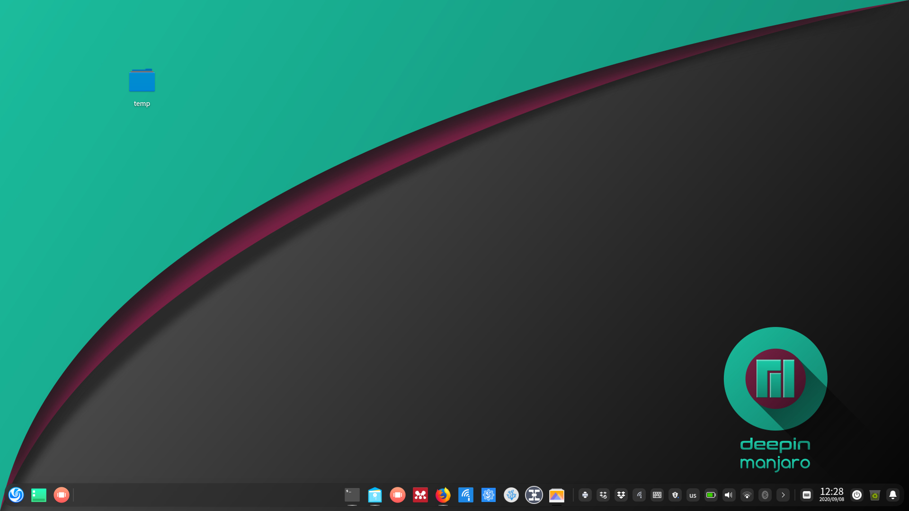
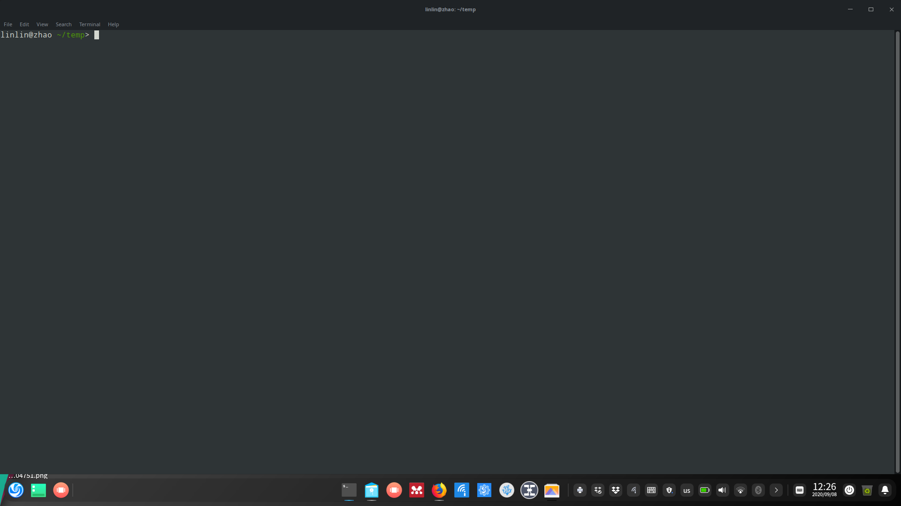
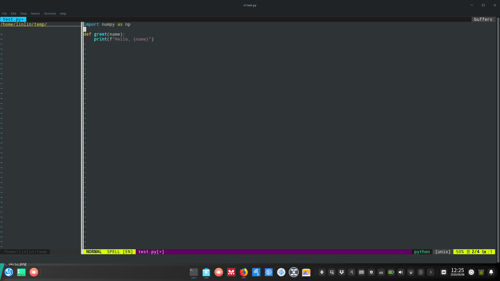

# Backup my configs on Linux

I've been happily using Manjaro with Deepin Desktop for quite a long time. This repo is for the ease of setting up a couple of machines that I will need to switch back and forth. I work with Python, LaTex and markdown a lot, so the settings is biased towards these tools. 

### A few basic setups in Manjaro

`setup_manjaro.sh` contains commands for the setups of neovim, zsh, and Chinese typing.

Here is a screenshot of the current looking

I've gone through a few major updates of Deepin Desktop, tbh, I like previous lookings more.

### zsh configs

`cp zshrc $HOME/.zshrc`

A few customizations based on oh-my-zsh. A screenshot

### Neovim configs

`init.vim` goes to `$HOME/.config/nvim/`

A screenshot for editing python script.

### Vim configs

For configuring Vim, do this:
`cp vimrc $HOME/.vimrc`

